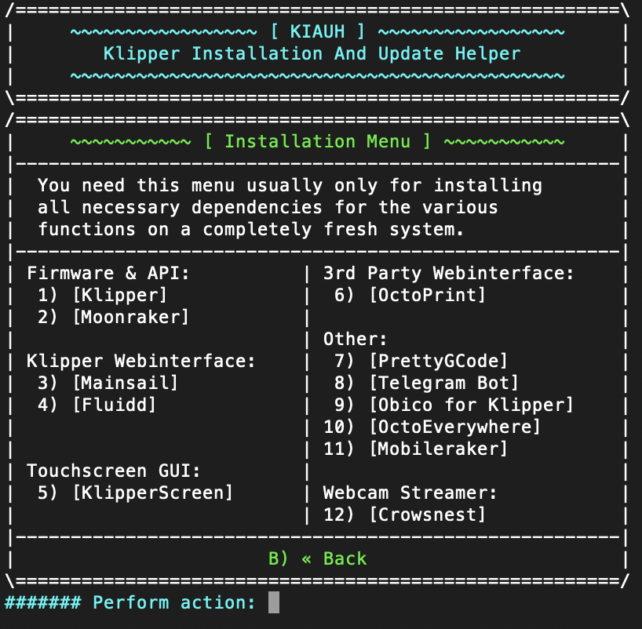

# Installing Klipper

> [!CAUTION]
> Do this at your own risk!

> [!IMPORTANT]
> This is still a work in progress and incomplete. 

## Install Raspberry Pi OS (lite)

1. [Download the Pi Imager](https://www.raspberrypi.com/software/)
1. Select `Choose OS -> Raspberry Pi OS (other)`
1. Select `Raspberry Pi OS Lite (32bit)`
1. Click `Edit Settings` under `Use OS customization`
1. Set Hostname, Set username and password (pi/raspberry are defaults), Set locale settings, and enable SSH under services.
1. Write to SD Card

## [Install KIAUH](https://github.com/dw-0/kiauh)

1. Open a terminal and ssh into your pi. `ssh username@hostname.local` Change the username and hostname to the ones you set above in step 5. 
1. `sudo apt-get update && sudo apt-get install git -y`
1. `cd ~ && git clone https://github.com/dw-0/kiauh.git`
1. `./kiauh/kiauh.sh`

## Install Klipper

1. Open a terminal and ssh into your pi. `ssh username@hostname.local`
1. `./kiauh/kiauh.sh`
1. Enter 1 for `1) [Install]`
1. 
   Install the following items in the this order (These 3 are required add more if you need them specifically)
   1. Klipper
   1. Moonraker
   1. Mainsail **OR** Fluidd (I will be using fluidd)

1. `sudo reboot` to reboot the pi

## [Building and Flashing your MCU](https://www.klipper3d.org/Installation.html#building-and-flashing-the-micro-controller)

1. Log in to Klipper via SSH
1. `cd ~/klipper/`
1. `make menuconfig`
1. Configure your settings according to the micro controller you are using.
   - Stock Rambo board (Taz6, Mini1, Mini2)
      - AVR atmega2560
   - Archim2 board (Taz6)
      - SAM3x8e
1. `make`
1. Plug in the printer via USB to pi and power it on.
1. `ls /dev/serial/by-id/*`
1. You printer should appear and look something like this. This is a unique ID and you'll need it later for the config file as well.
   - `/dev/serial/by-id/usb-1a86_USB2.0-Serial-if00-port0`
1. Now it's time to flash your board. Replace the ID with the one you got in the previous step.
   - `sudo service klipper stop`
   - `make flash FLASH_DEVICE=/dev/serial/by-id/usb-1a86_USB2.0-Serial-if00-port0`
   - `sudo service klipper start`
1. Reboot everything `sudo reboot`

## Adding and Configuring the printer.cfg

1. Open your broswer and head over to your printer.
1. On the left column select the `Configuation {...}` section
1. Locate your config file (there are some sample configs in the `configs` folder)

## Inital Test and Tuning

### Home and Initial Checks

From the Fluidd home screen, press the home button, and stand next to the power button just in case there are crashes. If the printer homes successfully, we are ready to move on.

### Initial Tunning

We are going to run some tests to make sure the printer is working correctly.

1. Check `rotaion distace`
1. Temp Tower
1. Flow Calibration
1. Pressure Advance Tuning
1. Calibration Cube Test Print
1. Input Shaper

## Input Shaper with a RP2040 and ADXL345

### Compile Firmware

1. Log into your printer via SSH.
1. `cd ~/klipper/`
1. `make menuconfig`
1. pic of selection
1. `Q` then `Y` to save
1. `make`

### Flash Firmware

1. Connect the Pi Pico (RP2040) holding down the `BOOTSEL` button
1. Given no other mass storage devices are existing, the Pico should register as block device `/dev/sda`
1. Mount the block device and copy the Klipper firmware file to it
	- `sudo mount /dev/sda1 /mnt`
	- `sudo cp out/klipper.uf2 /mnt`
	- `sudo umount /mnt`
1. After un-mounting, the Pico should automatically reboot with the new firmware.

### Configuring Klipper

1. Get the correct `serial` path with `ls /dev/serial/by-id/*`
1. It should look like this `/dev/serial/by-id/usb-Klipper_rp2040_45503571290DDAE8-if00`
1. Enter this value into the `adxl.cfg` file
1. Restart Klipper
